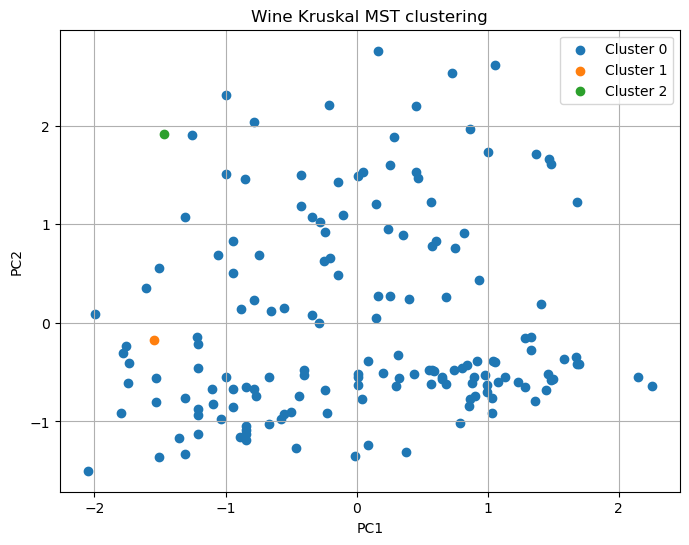
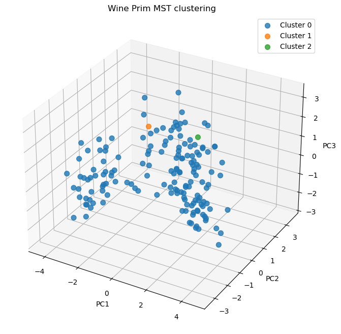
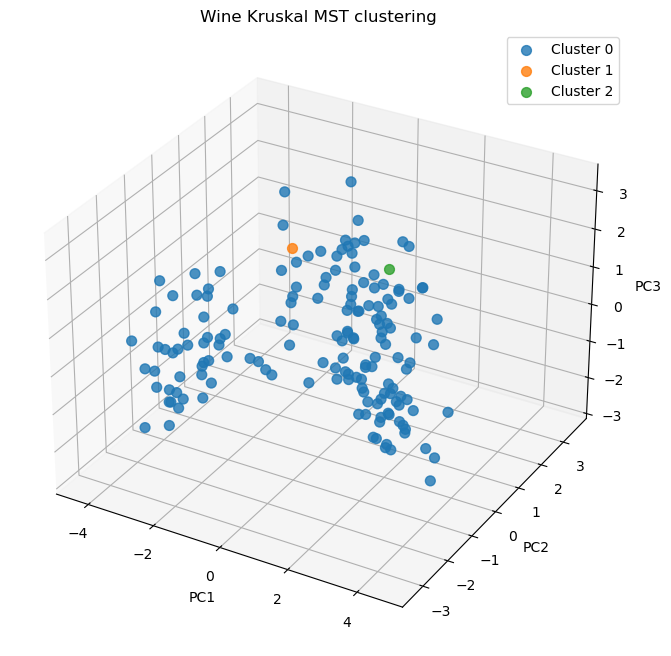
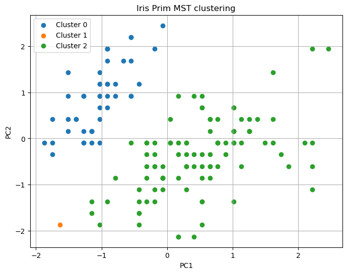
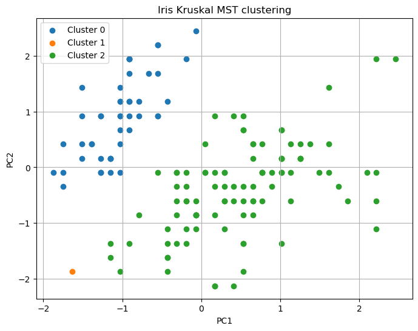
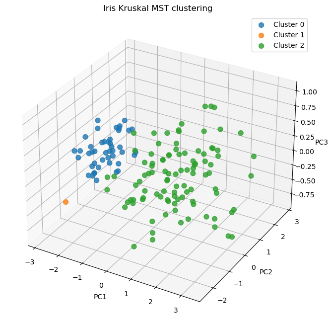

1. A cover page with the name of the two (and exactly two!) members of the group

put a picture of UPC maybe? we have to knit to pdf i think

\begin{titlepage}
    \centering
    \vspace*{4cm} % Adjust vertical spacing
    \includegraphics[width=\textwidth]{./UPC.jpg}
    \vfill
    {\Huge \textbf{OTDM Lab assignment 3: Cluster median.}} \\[1.5cm]
    {\Large Authors: Julian Fransen, Danila Kokin} \\[0.5cm]
    {\Large Date: \today}
    \vfill
\end{titlepage}


## 2. Description of Data Matrix A

### Title: Wine Data (Adapted for Unsupervised Learning)

### Sources:
- **Original Source**: UCI Machine Learning Repository
- **Original Dataset**: [Wine Dataset](https://archive.ics.uci.edu/ml/datasets/wine)
- **Creator**: Forina et al. (1991), Analytical Chemistry

### Relevant Information:
These data are the results of a chemical analysis of wines grown in the same region in Italy, derived from three different cultivars. The analysis determined the quantities of 13 constituents found in each of the three types of wines. The dataset is adapted for unsupervised learning by removing the labels that classify the types of wines.

- **Data Usage**: Frequently used for clustering, PCA, and classification studies.
- **Domain**: Chemistry, wine analysis, and machine learning.

### Number of Instances:
- 178 wine samples.

### Number of Attributes:
- 13 numeric continuous attributes.

### Attribute Information:
1. Alcohol
2. Malic acid
3. Ash
4. Alcalinity of ash
5. Magnesium
6. Total phenols
7. Flavanoids
8. Nonflavanoid phenols
9. Proanthocyanins
10. Color intensity
11. Hue
12. OD280/OD315 of diluted wines
13. Proline

### Missing Attribute Values:
- None.

### Preprocessing:
The dataset was scaled using Z-score normalization to standardize the features to zero mean and unit variance for better interpretability and clustering performance. After scaling, the Euclidean distance was calculated, and this matrix of distances was formatted to AMPL compatible .dat files.

### Summary Statistics:

```{r echo=FALSE}
summary_stats <- data.frame(
  Feature = c("Alcohol", "Malic acid", "Ash", "Alcalinity of ash", "Magnesium", 
              "Total phenols", "Flavanoids", "Nonflavanoid phenols", 
              "Proanthocyanins", "Color intensity", "Hue", 
              "OD280/OD315 of diluted wines", "Proline"),
  Min = c(11.03, 0.74, 1.36, 10.6, 70, 0.98, 0.34, 0.13, 0.41, 1.28, 0.48, 1.27, 278),
  Max = c(14.83, 5.80, 3.23, 30.0, 162, 3.88, 5.08, 0.66, 3.58, 13.0, 1.71, 4.00, 1680),
  Mean = c(13.00, 2.34, 2.36, 19.49, 99.74, 2.29, 2.03, 0.36, 1.59, 4.71, 0.96, 2.61, 746.89),
  `Standard Deviation` = c(0.81, 1.12, 0.27, 3.34, 14.28, 0.63, 0.99, 0.12, 0.57, 2.43, 0.23, 0.71, 314.91)
)

knitr::kable(summary_stats, format = "markdown", col.names = c("Feature", "Min", "Max", "Mean", "Standard Deviation"))
```

## 3. The AMPL `.mod` and `.dat` Files

### Sample of `wine.dat` File:

```plaintext
param m := 178;
param k := 3;
param d: 1 2 ... 177 178 :=
1   0.000000  3.497535 ...  6.078781  7.184421
2   3.497535  0.000000 ...  6.094927  7.367719
... 
178 7.184421  7.367719 ...  3.324276  0.000000;
```

### Contents of `clustering.mod` file:

```plaintext
/#Below we define the AMPL model for clustering
param m;
param k;
param d{1..m, 1..m};
var x{1..m, 1..m} binary;

minimize f: sum{i in 1..m, j in 1..m} d[i,j]*x[i,j];
subject to c1{i in 1..m}: sum{j in 1..m} x[i,j] = 1;
/# This constraint ensures every point belongs to 1 cluster
subject to c2: sum{j in 1..m} x[j,j] = k;
/# This constraint ensure that there are exactly k clusters
subject to c3{i in 1..m, j in 1..m}: x[j,j] >= x[i,j];
/# This constraint ensures that a point can only be part of a cluster that exists
```


## 4. The optimal solution obtained with AMPL.

```{bash, echo=FALSE}
cd /home/julian/uni_folder/OTDM/OTDM_Project_2/3/linprog/
/home/julian/uni_folder/OTDM/OTDM_p2/OTDM/ampl_linux-intel64/ampl << EOF 

reset;
reset data;

model clustering.mod;
data wine2.dat;
option solver cplex;
option cplex_options 'timing 1';
solve;

print "     Matrix x (formulation)"; 
print "";

print "     Number of points per cluster"; 
print "";

var total{i in 1..m};

for {i in 1..m} {
    for {j in 1..m} {
        let total[i] := total[i] + x[j,i];
    }
}

# Display only non-zero total values
print "     Non-zero clusters";
for {i in 1..m: total[i] > 0} {
    printf "Cluster %d has %d points\n", i, total[i];
}

EOF
```

## 5. A description of how the minimum spanning tree was computed (which software used, etc.)

The Minimum Spanning Tree (MST) computation and subsequent clustering process were implemented using Python in a Jupyter Notebook environment (.ipynb file). The following steps describe the methodology and tools used:

#### Preprocessing

- Outlier Removal: outlier detection and removal function based on the Interquartile Range (IQR) rule was implemented. Data points beyond 1.5 times the IQR from the first quartile (Q1) or third quartile (Q3) were identified as outliers and removed. This ensured the data was clean before clustering.
- Data Normalization: cleaned dataset was standardized using z-score normalization, where each feature was transformed to have a mean of 0 and a standard deviation of 1.
	
#### MST Construction

##### Software and Libraries
- The MST computation was implemented using the Python library NetworkX.
- Pairwise distances between data points were calculated using SciPy’s pdist function, which computes the Euclidean distance.
-	The distance matrix was converted into a weighted graph using NetworkX’s Graph class.

##### Algorithm Choice
-	Two MST algorithms, Prim’s and Kruskal’s, were available, and the user could specify which to use by setting the algorithm parameter to 'prim' or 'kruskal'. This flexibility was provided by NetworkX’s minimum_spanning_tree function, which supports both algorithms.

##### Steps
- A distance matrix was computed using pdist.
- A weighted graph was constructed where nodes represented data points and edges represented pairwise distances.
- The MST was computed using the specified algorithm.
	
#### Clustering by MST Partitioning

- Edge Removal: to partition the MST into the desired number of clusters (k), the `k-1` largest edges (based on their weights) were removed. This step disconnected the MST into k connected components, each representing a cluster.
- Connected Components: the connected components of the resulting graph were identified using NetworkX’s connected_components function.
- Cluster Assignments: each connected component was assigned a unique cluster label, and the data points in each component were grouped accordingly.

## 6. The heuristic solution obtained with the minimum spanning tree procedure.

### Wine Dataset

In the following analysis, we applied Prim’s and Kruskal’s algorithms to create Minimum Spanning Trees (MSTs) on the wine dataset. The clustering results are visualized in both 2D and 3D plots:

Prim's algorithm          |  Kruskal's algorithm  
:-------------------------:|:-------------------------:
  |  


Prim's algorithm          |  Kruskal's algorithm  
:-------------------------:|:-------------------------:
  |  

Initially, the clustering results appeared suboptimal, with clusters formed as follows:

- 1 obseravation in cluster 2

- 1 obseravation in cluster 1

- 59 observstions (the rest) in cluster 0

This distribution raised concerns about the algorithm’s performance. However, it is important to note that the variance explained by the first three principal components is relatively low:

```plaintext
Explained variance by each principal component: [0.38853448 0.20487624 0.09547051]
```

Given this, the clustering results may be valid but are challenging to interpret visually in 2D or 3D projections. To further evaluate the algorithm’s performance, we tested it on a dataset with lower dimensionality.

### Iris Dataset

The Iris dataset, a widely known benchmark, includes only four features and three distinct plant classes. After applying outlier detection, scaling, and cleaning, we ran the same MST algorithms. The resulting clusters are illustrated below:

Prim's algorithm          |  Kruskal's algorithm  
:-------------------------:|:-------------------------:
  |  


Prim's algorithm          |  Kruskal's algorithm  
:-------------------------:|:-------------------------:
  |  

In this case, the variance explained by the first three principal components is significantly higher, with a cumulative total nearing 90%:

```plaintext
Explained variance by each principal component: [0.72600625 0.23072944 0.03802925]
```

This higher explained variance allows for a more accurate and visually interpretable clustering. The 3D plots particularly highlight well-defined clusters, demonstrating that the algorithms perform well.

## 7. A comparison of the two solutions obtained, in terms of the objective function of the integer optimization problem. Optionally, you may provide any other additional criteria for comparison.

The results of the two approaches differ significantly when evaluated based on the objective function value of the integer optimization problem:

- **AMPL Solution:** Achieved an objective value of `500.929194`, indicating a more optimal and compact clustering solution with minimal within-cluster distances.

- **Heuristic Approach:** Produced a total within-cluster distance of `61440.712295`, which is considerably higher, suggesting a less efficient clustering outcome compared to the AMPL solution.

(Potential inerpretation)??
In conclusion, the AMPL solution demonstrates superior performance in terms of the objective function, while the heuristic approach offers practical benefits such as speed and scalability.

## 8. Any other observation or comment you may want to add, or any problem you had when performing the assignment.

Conclusion: 
...

# Not to be included:

```{r}
#cd /home/julian/uni_folder/OTDM/OTDM_Project_2/3/linprog/
```

(for generating script:
cd /home/julian/uni_folder/OTDM/OTDM_Project_2/3/linprog/
python3 clean_data_linprog.py wine-clustering.csv 3 scaledWine.txt matrixWine.txt ",")


